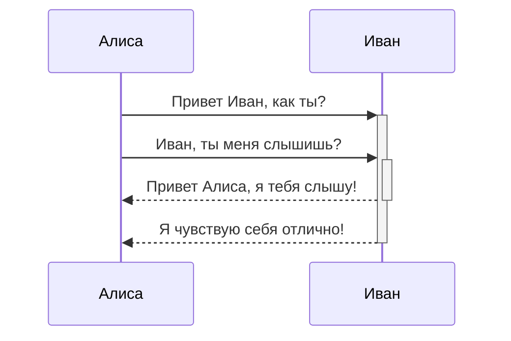
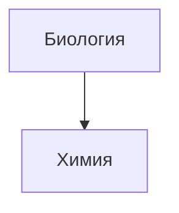

---
tags:
  - Test
time: 2024-05-30T13:26:00
cssclasses:
---
# Test note
# Hello world!
## Hello world!
### Hello world!
#### Hello world!
###### Hello world!
###### Hello world!

*Этот текст будет выделен курсивом*
_Этот текст тоже выделен курсивом_

**Этот текст будет жирным**
__Этот текст тоже будет жирным__

_Их **Можно** комбинировать_

- Предмет 1
- Предмет 2
  - Предмет 2а
  - Предмет 2б

1. Предмет 1
2. Предмет 2
3. Предмет 3
  1. Предмет 3а
  2. Предмет 3б

[Obsidian](http://obsidian.md)

> Люди сталкиваются со всё более сложными и неотложными проблемами, и их эффективность в решении этих проблем имеет решающее значение для стабильности и дальнейшего прогресса общества.

\- Дуглас Энгельбарт, 1961

[Ссылка на файл](obsidian://open?path=D:%2Fpath%2Fto%2Ffile.md)

- [ ] поддерживаются теги, [ссылки](), **форматирование**
- [!] используется синтаксис списка (поддерживаются упорядоченный или не упорядоченные списки.)
- [?] это незавершенная задача
- [<] задачи в области предварительного просмотра помечаются завершенными при нажатии на чек бокс

| Первый заголовок          | Второй заголовок          |
| ------------------------- | ------------------------- |
| Первый заголовок          | Содержимое второй ячейки  |
| Содержимое первой колонки | Содержимое второй колонки |

Любой текст заключенный в двойные тильды (например, ~~так~~) будет отображаться как зачеркнутый.

Пример простой сноски[^1] и пример сноски подлиннее[^большая_сноска].
[^1]: со смыслом! [^большая_сноска]:
с несколькими абзацами и кодом.
	Делайте отступ перед абзацем, чтобы включить его в сноску. `{ мой код }` Абзацев может быть сколько угодно.

Сноски также можно оставлять прямо в тексте.^[обратите внимание, что карет `^` при этом выносится за скобки.]

$$\begin{vmatrix}a & b\\ c & d \end{vmatrix}=ad-bc$$

Комментарий внутри текста: %%скрытый комментарий%% (который, не виден в режиме предварительного просмотра) Скрытый блок с комментариями: (который, так же не виден в режиме предварительного просмотра) %% Он может содержать множество строк %%

1. со смыслом
    
2. с несколькими абзацами и кодом.
    
    Делайте отступ перед абзацем, чтобы включить его в сноску.
    
    `{ мой код }`
    
    Абзацев может быть сколько угодно.[↩︎](https://publish.obsidian.md/#fnref-2-c0ae069db6e94bf2)
    
3. обратите внимание, что карет `^` при этом выносится за скобки. [↩︎](https://publish.obsidian.md/#fnref-3-c0ae069db6e94bf2)

<iframe src="https://www.youtube.com/embed/NnTvZWp5Q7o"></iframe>

| Первый заголовок | Второй заголовок |
| ---------------- | ---------------- |
|                  |                  |
