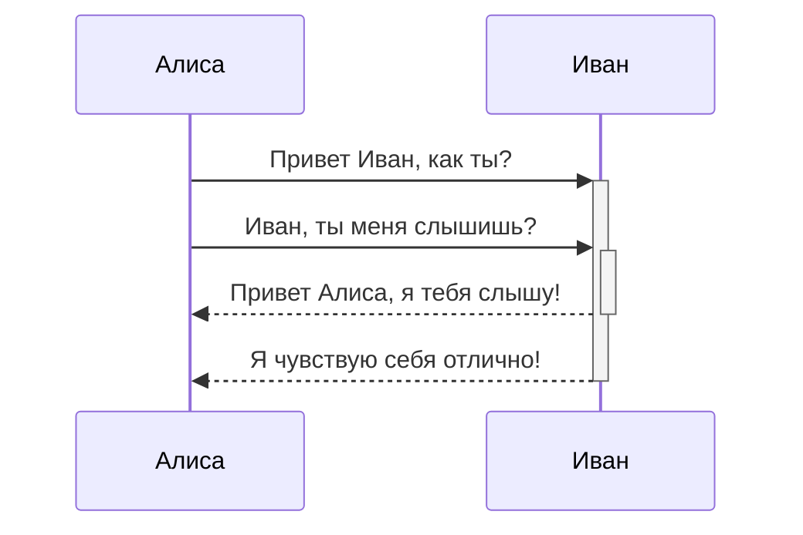
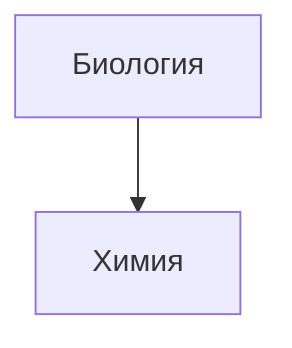

# Форматирование заметок

[[Obsidian]] это приложение для ведения заметок и базы знаний на основе Markdown.

На данный момент поддерживаются следующие элементы форматирования:

---

### Внутренние ссылки

```md
Ссылка на страницу: [[Создание внутренних ссылок]].
```

Ссылка на страницу: [Создание внутренних ссылок](https://publish.obsidian.md/help-ru/%D0%A0%D1%83%D0%BA%D0%BE%D0%B2%D0%BE%D0%B4%D1%81%D1%82%D0%B2%D0%B0/%D0%A1%D0%BE%D0%B7%D0%B4%D0%B0%D0%BD%D0%B8%D0%B5+%D0%B2%D0%BD%D1%83%D1%82%D1%80%D0%B5%D0%BD%D0%BD%D0%B8%D1%85+%D1%81%D1%81%D1%8B%D0%BB%D0%BE%D0%BA).

---

### Вложенные файлы

Вложение другого файла (узнать больше о [встраивании вложений в заметки](https://publish.obsidian.md/help-ru/%D0%A0%D1%83%D0%BA%D0%BE%D0%B2%D0%BE%D0%B4%D1%81%D1%82%D0%B2%D0%B0/%D0%92%D1%81%D1%82%D1%80%D0%B0%D0%B8%D0%B2%D0%B0%D0%BD%D0%B8%D0%B5+%D0%B2%D0%BB%D0%BE%D0%B6%D0%B5%D0%BD%D0%B8%D0%B9+%D0%B2+%D0%B7%D0%B0%D0%BC%D0%B5%D1%82%D0%BA%D0%B8)). Далее показан пример вложения раздела заметки об Obsidian:

```md
![[Obsidian#Что такое Obsidian]]
```

[[Встраивание вложений в заметки]] - связь в хранилище!
## Что такое Obsidian

Obsidian — это Markdown редактор и приложение для ведения базы знаний.

В самом простом примере использования вы можете редактировать и просматривать Markdown файлы. Но истинная мощь кроется в управлении плотно сплетенными связями в базе знаний.

Вы спросите, как начать создавать связи? Для начала давайте попробуем сделать несколько [внутренних ссылок](https://publish.obsidian.md/help-ru/%D0%A0%D1%83%D0%BA%D0%BE%D0%B2%D0%BE%D0%B4%D1%81%D1%82%D0%B2%D0%B0/%D0%A1%D0%BE%D0%B7%D0%B4%D0%B0%D0%BD%D0%B8%D0%B5+%D0%B2%D0%BD%D1%83%D1%82%D1%80%D0%B5%D0%BD%D0%BD%D0%B8%D1%85+%D1%81%D1%81%D1%8B%D0%BB%D0%BE%D0%BA)!

---

### Заголовки

```md
# Это заголовок 1
## Это заголовок 2
### Это заголовок 3
#### Это заголовок 4
##### Это заголовок 5
###### Это заголовок 6
```


# Это заголовок 1

## Это заголовок 2

### Это заголовок 3

#### Это заголовок 4

##### Это заголовок 5

###### Это заголовок 6

---

### Выделение

```md
*Этот текст будет выделен курсивом*
_Этот текст тоже будет выделен курсивом_
```

_Этот текст отобразится курсивом_  
_Этот текст отобразится курсивом_

```md
**Этот текст будет выделен жирным шрифтом**
__Этот текст тоже будет выделен жирным шрифтом__
```

**Этот текст будет выделен жирным шрифтом**  
**Этот текст тоже будет выделен жирным шрифтом**

```md
_Их **можно** комбинировать_
```

_Их **можно** комбинировать_

---

### Списки

```md
- Предмет 1
- Предмет 2
  - Предмет 2a
  - Предмет 2b

1. Предмет 1
1. Предмет 2
1. Предмет 3
   1. Предмет 3a
   1. Предмет 3b
```

- Предмет 1
- Предмет 2
    - Предмет 2a
    - Предмет 2b

1. Предмет 1
2. Предмет 2
3. Предмет 3
    1. Предмет 3a
    2. Предмет 3b

---

### Изображения

```md

```


#### Изменение размера изображений

Пример уменьшения размера верхнего изображения до 100 пикселей в ширину:

```md

```


---

### Ссылки

#### Внешние ссылки

Ссылки в формате Markdown можно использовать как для отсылки к внешним объектам вроде веб-страниц, так и к внутренним страницам или изображениям.

```md
http://obsidian.md — создаются автоматически!
[Obsidian](http://obsidian.md)
```

[http://obsidian.md](http://obsidian.md/) — создаются автоматически!  
[Obsidian](http://obsidian.md/)

#### Ссылки Obsidian URI

Ссылки [Obsidian URI](https://publish.obsidian.md/help-ru/%D0%9F%D1%80%D0%BE%D0%B4%D0%B2%D0%B8%D0%BD%D1%83%D1%82%D0%BE%D0%B5+%D0%B8%D1%81%D0%BF%D0%BE%D0%BB%D1%8C%D0%B7%D0%BE%D0%B2%D0%B0%D0%BD%D0%B8%D0%B5/%D0%98%D1%81%D0%BF%D0%BE%D0%BB%D1%8C%D0%B7%D0%BE%D0%B2%D0%B0%D0%BD%D0%B8%D0%B5+Obsidian+URI) могут использоваться для открытия заметок из текущего хранилища, из другого хранилища или других программ.

Например, вы можете вставить ссылку на файл в хранилище следующим образом (обратите внимание на [обязательную кодировку](https://publish.obsidian.md/help-ru/%D0%9F%D1%80%D0%BE%D0%B4%D0%B2%D0%B8%D0%BD%D1%83%D1%82%D0%BE%D0%B5+%D0%B8%D1%81%D0%BF%D0%BE%D0%BB%D1%8C%D0%B7%D0%BE%D0%B2%D0%B0%D0%BD%D0%B8%D0%B5/%D0%98%D1%81%D0%BF%D0%BE%D0%BB%D1%8C%D0%B7%D0%BE%D0%B2%D0%B0%D0%BD%D0%B8%D0%B5+Obsidian+URI#%D0%9A%D0%BE%D0%B4%D0%B8%D1%80%D0%BE%D0%B2%D0%BA%D0%B0)):

```md
[Ссылка на файл](obsidian://open?path=D:%2Fpath%2Fto%2Ffile.md)
```

[Ссылка на файл](obsidian://open?path=D:%2Fpath%2Fto%2Ffile.md)

Вы так же можете вставить ссылку на файл указав имя хранилища и имя файла, без полного пути до него:

```md
[Ссылка на файл](obsidian://open?vault=MainVault&file=MyNote.md)
```

[Ссылка на файл](obsidian://open?vault=MainVault&file=MyNote.md)
[[Использование Obsidian URI]] - ссылка в obsidiane

#### Экранирование

Если в ссылке есть пробелы, они могут быть экранированы. Например, с использованием кода `%20` вместо пробелов:

```md
[Импорт данных](Импорт%20данных)
```

[Импорт данных](https://publish.obsidian.md/help-ru/%D0%A0%D1%83%D0%BA%D0%BE%D0%B2%D0%BE%D0%B4%D1%81%D1%82%D0%B2%D0%B0/%D0%98%D0%BC%D0%BF%D0%BE%D1%80%D1%82+%D0%B4%D0%B0%D0%BD%D0%BD%D1%8B%D1%85)

Или вы можете заключить цель в угловые скобки `<>`:

```md
[Демонстрация слайдов](<Демонстрация слайдов>)
```

[Демонстрация слайдов](https://publish.obsidian.md/help-ru/%D0%92%D0%BB%D0%BE%D0%B6%D0%B5%D0%BD%D0%B8%D1%8F/%D0%94%D0%B5%D0%BC%D0%BE%D0%BD%D1%81%D1%82%D1%80%D0%B0%D1%86%D0%B8%D1%8F+%D1%81%D0%BB%D0%B0%D0%B9%D0%B4%D0%BE%D0%B2)

---

### Цитирование

```md
> Люди сталкиваются со всё более сложными и неотложными проблемами, и их эффективность в решении этих проблем имеет решающее значение для стабильности и дальнейшего прогресса общества.

\- Дуглас Энгельбарт, 1961
```

> Люди сталкиваются со всё более сложными и неотложными проблемами, и их эффективность в решении этих проблем имеет решающее значение для стабильности и дальнейшего прогресса общества.

- Дуглас Энгельбарт, 1961

---

### Встроенный код

```md
Текст внутри `обратных кавычек` в строке будет отображаться как код. 
```

Текст внутри `обратных кавычек` в строке будет отображаться как код.

---

### Блоки кода

Подсветка синтаксиса кода поддерживается путем указания языка после первых трех обратных кавычек. Для подсветки мы используем библиотеку PrismJS, список поддерживаемых языков можно найти [на их сайте](https://prismjs.com/#supported-languages).


```js
function fancyAlert(arg) {
  if(arg) {
    $.facebox({div:'#foo'})
  }
}
```


```js
function fancyAlert(arg) {
  if(arg) {
    $.facebox({div:'#foo'})
  }
}
```

```md
	Текст с отступом, сделанным с помощью табуляции, будет
	выглядеть как блок кода в области предварительного просмотра.
```

```
Текст с отступом, сделанным с помощью табуляции, будет выглядеть как блок кода в области предварительного просмотра.
```

---

### Список задач

```md
- [x] поддерживаются #теги, [ссылки](), **форматирование**
- [x] используется синтаксис списка (поддерживаются упорядоченный или не упорядоченный списки)
- [x] это завершенная задача
- [?] это тоже завершенная задача (работает с любым символом)
- [ ] это незавершенная задача
- [ ] задачи в области предварительного просмотра помечаются завершенными при нажатии на чекбокс
```

- [x] поддерживаются [#теги](https://publish.obsidian.md/#%D1%82%D0%B5%D0%B3%D0%B8), [ссылки](https://publish.obsidian.md/#), **форматирование**
- [x] используется синтаксис списка (поддерживаются упорядоченный или не упорядоченный списки)
- [x] это завершенная задача
- [?] это тоже завершенная задача (работает с любым символом)
- [x] это незавершенная задача
- [ ] задачи в области предварительного просмотра помечаются завершенными при нажатии на чекбокс

---

### Таблицы

Вы можете создавать таблицы из списков слов. Шапка таблицы (первая строка) отделяется от остальных строк дефисами `-`. Столбцы разделяются вертикальной чертой `|`:

```md
Первый заголовок | Второй заголовок
------------ | ------------
Первый заголовок | Содержимое второй ячейки
Содержимое первой колонки | Содержимое второй колонки
```

|Первый заголовок|Второй заголовок|
|---|---|
|Первый заголовок|Содержимое второй ячейки|
|Содержимое первой колонки|Содержимое второй колонки|

---

```md
В таблицах поддерживается выравнивание | Пример выравнивания
:------------|------------:
по краю с использованием двоеточия `:` | по правому краю
```

|В таблицах поддерживается выравнивание|Пример выравнивания|
|:--|--:|
|по краю с использованием двоеточия `:`|по правому краю|

В таблицах работаю ссылки. Если в ссылке используется вертикальная черта `|`, она должна быть изолирована символом `\`, чтобы не быть распознанной как элемент таблицы.

```md
Первый заголовок | Второй заголовок
------------ | ------------
[[Форматирование заметок\|Форматирование]] | [[Сочетания клавиш\|Горячие клавиши]]
```

| Первый заголовок                                                                                                                                                                                                                                         | Второй заголовок                                                                                                                                                                                                      |
| -------------------------------------------------------------------------------------------------------------------------------------------------------------------------------------------------------------------------------------------------------- | --------------------------------------------------------------------------------------------------------------------------------------------------------------------------------------------------------------------- |
| [Форматирование](https://publish.obsidian.md/help-ru/%D0%A0%D1%83%D0%BA%D0%BE%D0%B2%D0%BE%D0%B4%D1%81%D1%82%D0%B2%D0%B0/%D0%A4%D0%BE%D1%80%D0%BC%D0%B0%D1%82%D0%B8%D1%80%D0%BE%D0%B2%D0%B0%D0%BD%D0%B8%D0%B5+%D0%B7%D0%B0%D0%BC%D0%B5%D1%82%D0%BE%D0%BA) | [Горячие клавиши](https://publish.obsidian.md/help-ru/%D0%A0%D1%83%D0%BA%D0%BE%D0%B2%D0%BE%D0%B4%D1%81%D1%82%D0%B2%D0%B0/%D0%A1%D0%BE%D1%87%D0%B5%D1%82%D0%B0%D0%BD%D0%B8%D1%8F+%D0%BA%D0%BB%D0%B0%D0%B2%D0%B8%D1%88) |

---

### Зачеркивание

```md
Любой текст заключенный в двойные тильды (например, ~~так~~) будет отображаться как зачеркнутый.
```

Любой текст заключенный в двойные тильды (например, ~~так~~) будет отображаться как зачеркнутый.

---

### Подсветка

```md
Используя двойные знаки равенства можно ==подсветить текст==.
```

Используя двойные знаки равенства можно ==подсветить текст==.

---

### Сноски

```md
Пример простой сноски[^1] и пример сноски подлиннее[^большая_сноска].

[^1]: со смыслом!

[^большая_сноска]: с несколькими абзацами и кодом.

    Делайте отступ перед абзацем, чтобы включить его в сноску.

    `{ мой код }`

    Абзацев может быть сколько угодно.
```

Пример простой сноски[1](https://publish.obsidian.md/#fn-1-c0ae069db6e94bf2) и пример сноски подлиннее[2](https://publish.obsidian.md/#fn-2-c0ae069db6e94bf2).

```md
Сноски также можно оставлять прямо в тексте.^[обратите внимание, что карет `^` при этом выносится за скобки.]
```

Сноски также можно оставлять прямо в тексте.[3](https://publish.obsidian.md/#fn-3-c0ae069db6e94bf2)

### Математические формулы

Для отображения формулы в отдельном блоке, необходимо заключить ее в двойные `$$`:

```md
$$\begin{vmatrix}a & b\\
c & d
\end{vmatrix}=ad-bc$$
```

$$\begin{vmatrix}a & b\\ c & d \end{vmatrix}=ad-bc$$

```md
Так же возможно отображение формулы внтури строки $e^{2i\pi} = 1$.
```

Так же возможно отображение формулы внутри строки .

Obsidian использует библиотеку [Mathjax](http://docs.mathjax.org/en/latest/basic/mathjax.html) для отображения математических формул. Вы можете ознакомиться со списком расширений поддерживаемых в Mathjax [тут](http://docs.mathjax.org/en/latest/input/tex/extensions/index.html).

### Комментарии

Используйте двойные `%%` для вложения комментариев, которые будут распознаны как текст Markdown, но не будут показаны в режиме предварительного просмотра.

```md
Комментарий внутри текста: %%скрытый комментарий%% (который, не виден в режиме предварительного просмотра)

Скрытый блок с комментариями: (который, так же не виден в режиме предварительного просмотра)
%%
Он может содержать
множество строк
%%
```

Комментарий внутри текста: (который, не виден в режиме предварительного просмотра)

Скрытый блок с комментариями: (который, так же не виден в режиме предварительного просмотра)

### Диаграммы

Obsidian использует библиотеку [Mermaid](https://mermaid-js.github.io/) для отображения диаграмм и схем. У Mermaid есть удобный [«живой редактор»](https://mermaid-js.github.io/mermaid-live-editor).





ИванАлисаИванАлисаПривет Иван, как ты?Иван, ты меня слышишь?Привет Алиса, я тебя слышу!Я чувствую себя отлично!

Obsidian поддерживает ссылки на заметки внутри элементов Mermaid:





Второй, но более простой способ:


Таким образом, все имена заметок (по крайней мере до `Z[имя заметки]`) автоматически присваиваются к классу `internal-link` при использовании этого фрагмента.

Если вы используете специальные символы в названиях заметок, то вам нужно заключать их в двойные кавычки:  
`"⨳ специальный символ"`

Во [втором способе](https://publish.obsidian.md/help-ru/%D0%A0%D1%83%D0%BA%D0%BE%D0%B2%D0%BE%D0%B4%D1%81%D1%82%D0%B2%D0%B0/%D0%A4%D0%BE%D1%80%D0%BC%D0%B0%D1%82%D0%B8%D1%80%D0%BE%D0%B2%D0%B0%D0%BD%D0%B8%D0%B5+%D0%B7%D0%B0%D0%BC%D0%B5%D1%82%D0%BE%D0%BA#^376b9d) это делается следующим образом:  
`A["⨳ специальный символ"]`

## Примечания разработчика

Мы стараемся соблюсти максимальную совместимость не нарушая существующие форматы, поэтому мы используем слегка необщепринятый комбинацию разновидностей Markdown. В общих чертах это CommonMark с добавлением некоторых возможностей из GitHub Flavored Markdown (GFM), с частичной поддержкой LaTeX и выбранным нами синтаксисом для вложений, о котором можно почитать тут: [поддерживаемые форматы файлов](https://publish.obsidian.md/help-ru/%D0%9F%D1%80%D0%BE%D0%B4%D0%B2%D0%B8%D0%BD%D1%83%D1%82%D0%BE%D0%B5+%D0%B8%D1%81%D0%BF%D0%BE%D0%BB%D1%8C%D0%B7%D0%BE%D0%B2%D0%B0%D0%BD%D0%B8%D0%B5/%D0%9F%D0%BE%D0%B4%D0%B4%D0%B5%D1%80%D0%B6%D0%B8%D0%B2%D0%B0%D0%B5%D0%BC%D1%8B%D0%B5+%D1%84%D0%BE%D1%80%D0%BC%D0%B0%D1%82%D1%8B+%D1%84%D0%B0%D0%B9%D0%BB%D0%BE%D0%B2).

---

1. со смыслом
    
2. с несколькими абзацами и кодом.
    
    Делайте отступ перед абзацем, чтобы включить его в сноску.
    
    `{ мой код }`
    
    Абзацев может быть сколько угодно.[↩︎](https://publish.obsidian.md/#fnref-2-c0ae069db6e94bf2)
    
3. обратите внимание, что карет `^` при этом выносится за скобки. [↩︎](https://publish.obsidian.md/#fnref-3-c0ae069db6e94bf2)

[[Работа с несколькими заметками]] - также рекомендуется для ознакомления.


### [Так же Есть Callouts](https://help.obsidian.md/Editing+and+formatting/Callouts)

>[!tip]
>Hello fire

>[!danger]
>DANGER!

>[!faq]-
>Where is my life?


### [[Добавление пользовательских CSS]]
