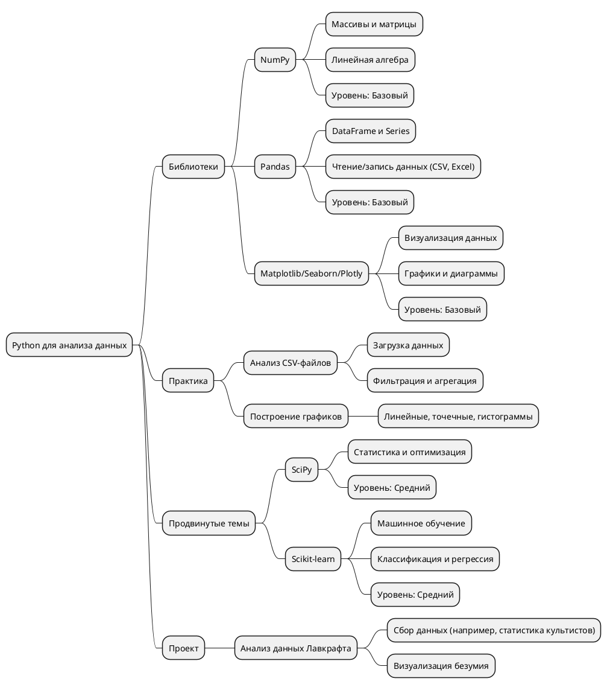
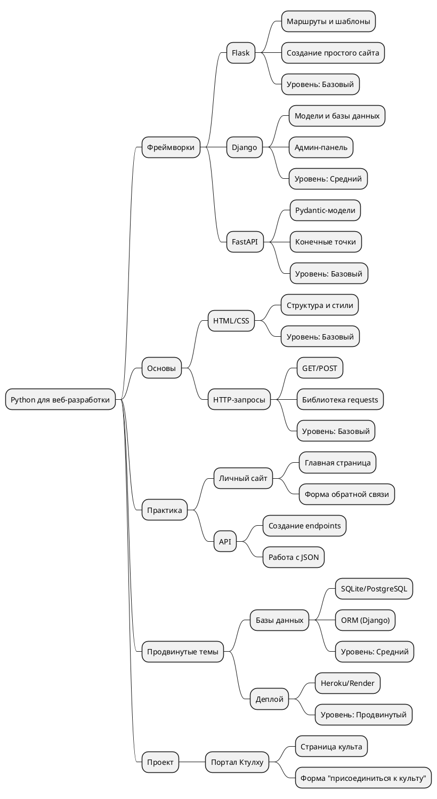
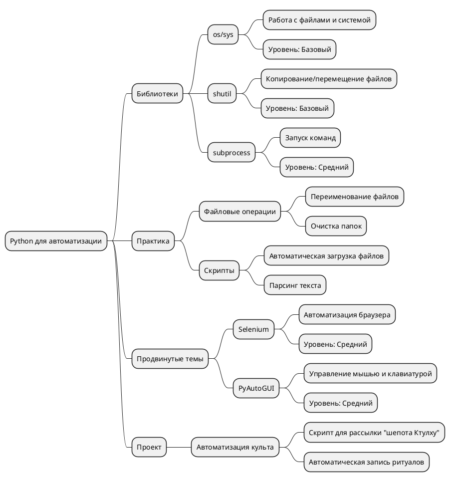
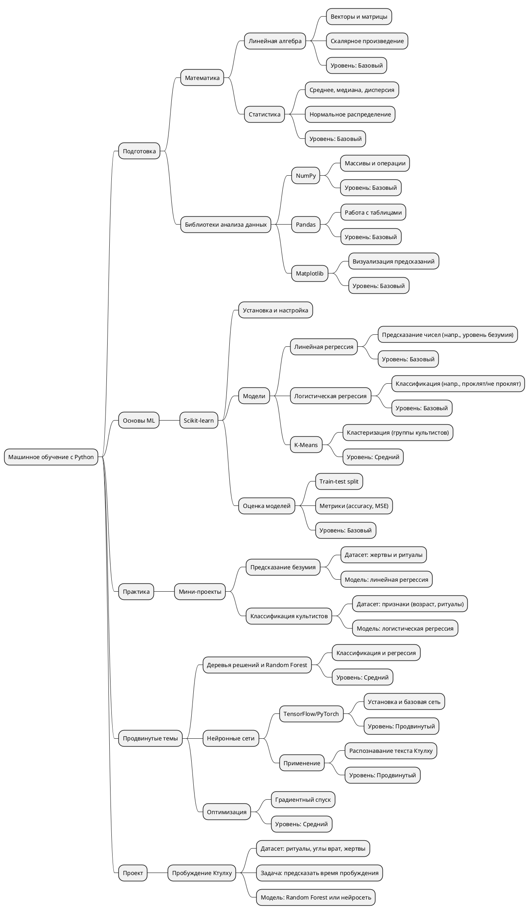
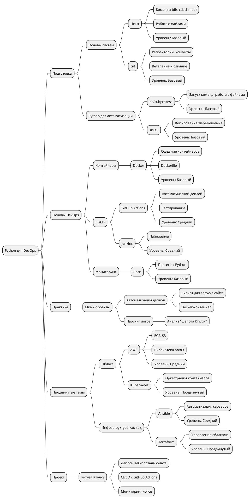

# Направления в Python в формате PlantUML
---

## Анализ данных и [[Data Science]] 🧑‍🔬

**Востребованность:** Очень высокая.

- **Почему?** Компании утопают в данных, как культисты в безумии Ктулху. Python — лидер в этой области благодаря библиотекам вроде [[NumPy]], [[Pandas]] и [[Scikit-learn]].
- **Кто ищет?** IT-гиганты ([[Google]], [[Amazon]]), финансы (банки, трейдинг), медицина, маркетинг.
- **Рынок:** По данным с X и веб-источников (на март 2025), вакансий для аналитиков данных и дата-сайентистов — тысячи. Средняя зарплата в США: $100k-$150k в год, в России: 2-5 млн рублей в год (junior-middle).
- **Перспективы:** Растёт спрос на машинное обучение и ИИ — это следующая ступень после базового анализа.
- **Лавкрафтовский бонус:** Ты можешь анализировать "уровень безумия" культов или предсказывать пробуждение Ктулху через данные!

**Вывод:** Одно из самых востребованных направлений, особенно если ты любишь математику и хочешь работать с большими объёмами информации.

**План действий:**

1. Установи numpy, pandas, [[matplotlib]] (pip install).
2. Начни с [[NumPy]]: массивы и простые вычисления.
3. Перейди к [[Pandas]]: работа с таблицами.
4. Освой визуализацию с [[Matplotlib]]/Seaborn.
5. Практика: проанализируй данные (например, [[csv]] с "жертвами Ктулху").
6. Двигайся к [[Scikit-learn]] для машинного обучения.

---
## Веб-разработка :LiNetwork:

**Востребованность:** Высокая и стабильная.

- **Почему?** Веб-приложения — это порталы в наш мир, как врата Йог-Сотота. [[Flask]] и [[Django]] делают Python популярным для backend-разработки.
- **Кто ищет?** Стартапы, e-commerce (интернет-магазины), крупные компании с внутренними системами.
- **Рынок:** Вакансий чуть меньше, чем в [[Data Science]], но они   стабильны. Средняя зарплата: $80k-$130k в США, 1.5-4 млн рублей в год в России. Часто комбинируется с фронтендом (HTML/CSS/JS).
- **Перспективы:** Спрос на full-stack разработчиков (backend + frontend) растёт. Также популярны микросервисы и [[API]].
- **Лавкрафтовский бонус:** Создай сайт культа Ктулху или веб-приложение для записи ритуалов!

**Вывод:** Классическое и надёжное направление с хорошим спросом, особенно если ты хочешь видеть результат своей работы в виде сайтов или приложений.

**План действий:**

1. Начни с [[Flask]]: установи (pip install flask) и создай простой сайт.
2. Освой [[HTML|HTML/CSS]] для базового дизайна.
3. Практика: сайт с одной страницей и формой.
4. Перейди к [[Django]] для работы с базами данных.
5. Изучи [[requests]] для взаимодействия с [[API]].
6. Проект: веб-портал для культистов Ктулху.

---
## Автоматизация и скрипты QA :LiTestTube2:

**Востребованность:** Средняя, но универсальная.

- **Почему?** Python — король автоматизации благодаря простоте и библиотекам вроде [[Selenium]] и [[PyAutoGUI]]. Это не отдельная профессия, а навык, востребованный везде.
- **Кто ищет?** Сисадмины, тестировщики (QA), DevOps, аналитики — все, кто хочет упростить рутину.
- **Рынок:** Меньше прямых вакансий (чаще "автоматизатор" —   часть другой роли), но навык добавляет +20-30% к зарплате в любой IT-сфере. Например, QA с Python: $70k-$120k в США, 1.5-3 млн рублей в России.
- **Перспективы:** Связка с DevOps (автоматизация [[CI_CD|CI/CD]]) или тестированием — горячая тема.
- **Лавкрафтовский бонус:** Автоматизируй "шепот Ктулху" для массовой рассылки или парсинг древних текстов!

**Вывод:** Не топ-1 по вакансиям, но супер-универсальный навык, который усиливает любую специальность.

**План действий:**

1. Освой [[os]] и [[shutil]]: работа с файлами и папками.
2. Практика: скрипт для переименования файлов.
3. Изучи [[subprocess]] для запуска внешних команд.
4. Попробуй [[Selenium]]: автоматизация веб-страниц.
5. Освой [[PyAutoGUI]] для управления компьютером.
6. Проект: скрипт для автоматизации "культовых" задач.

---

## Машинное обучение (ML/AI)🤖

- **Спрос:** Огромный. Компании вроде [[Google]], Tesla, [[OpenAI]] и  даже локальные стартапы ищут ML-специалистов. Вакансий тысячи, особенно в США, Китае и Европе.
- **Зарплаты:**
    - США: $120k-$200k+ в год (junior-senior).
    - Россия: 3-7 млн рублей в год (middle-senior).
- **Рынок:** По данным с X и веб-аналитики (март 2025), ML-инженеры и дата-сайентисты с ML-скиллами — в топ-3 IT-профессий по росту спроса.
- **Перспективы:** Рост ИИ (нейросети, ChatGPT-подобные модели) делает ML ещё более актуальным.

### План действий шаг за шагом

1. **Подготовка (1-2 недели):**
    - Освой базовую математику: Khan Academy или книга "Линейная алгебра" Гилберта Стренга (простые главы).
    - Повтори [[NumPy]] и [[Pandas]] из [[Data Science]] (ты уже знаком с [[random]] и [[math]]).
    - Установи Scikit-learn: pip install scikit-learn.
2. **Основы ML с Scikit-learn (2-3 недели):**
    - Начни с линейной регрессии: предсказывай числовые значения (например, "уровень хаоса").
    - Попробуй логистическую регрессию: классифицируй (например, "проклят ли культист").
    - Практика: возьми датасет ([[Kaggle]] или свой) и построй простую модель.
3. **Практика (2-4 недели):**
    - Мини-проект: предскажи "безумие культистов" на основе возраста и ритуалов.
    - Используй train_test_split для проверки качества модели.
4. **Продвинутые темы (1-2 месяца):**
    - Деревья решений и Random Forest: более сложные модели.
    - Нейронные сети: установи [[TensorFlow]] (pip install tensorflow) и попробуй простую сеть.
    - Оптимизация: разберись с градиентным спуском (видео на YouTube помогут).
5. **Финальный проект (2-4 недели):**
    - Создай датасет в стиле Лавкрафта: жертвы, ритуалы, углы врат.
    - Построй модель (Random Forest или нейросеть) для предсказания "пробуждения Ктулху".
    - Визуализируй результаты с [[Matplotlib]].

### Ресурсы

- **Книги:**
    - "Hands-On Machine Learning with Scikit-Learn, Keras, and [[TensorFlow]]" (Aurélien Géron) — библия ML.
    - "Python Machine Learning" (Sebastian Raschka) — тоже круто.
- **Курсы:**
    - Coursera: "Machine Learning" от Andrew Ng (классика).
    - Udemy: "Python for Data Science and Machine Learning Bootcamp".
- **Практика:**
    - [[Kaggle]]: соревнования и датасеты.
    - Напиши ML-модель для наших прошлых задач (например, предсказание хаоса Азатота).

---
## DevOps :LiKeyRound:

- **Спрос:** Очень высокий. Компании переходят на облака и микросервисы, и DevOps-инженеры — связующее звено.
- **Кто ищет?** IT-гиганты ([[Amazon]], [[Netflix]]), стартапы, финтех, гейминг.
- **Рынок:** По данным с X и веб-аналитики (март 2025), вакансий для DevOps растёт на 15-20% ежегодно. Средняя зарплата:
    - США: $100k-$160k в год (junior-senior).
    - Россия: 2-5 млн рублей в год (middle-senior).
- **Перспективы:** Рост облачных технологий ([[Kubernetes]], [[Docker]]) и ИИ-инструментов (AIOps) делает DevOps всё более востребованным.

### План действий шаг за шагом

1. **Подготовка (1-2 недели):**
    - Установи Linux (Ubuntu в VirtualBox или WSL на Windows).
    - Освой базовые команды: `ls` → `dir`, `cd`, `chmod`, `grep`.
    - Изучи [[Git]]: `git clone`, `git commit`, `git push`.
    - Повтори [[os]] и [[subprocess]] из Python (запуск команд, работа с файлами).
2. **Основы DevOps (2-4 недели):**
    - Установи [[Docker]] (docker run hello-world).
    - Создай контейнер для простого Python-приложения (например, [[Flask]]-сайта).
    - Настрой GitHub Actions: автоматический деплой кода.
    - Напиши скрипт для парсинга логов с [[os]].
3. **Практика (2-3 недели):**
    - Мини-проект: автоматизируй запуск веб-сайта в [[Docker]].
    - Попробуй парсить логи (например, "ритуалы культистов") с Python.
4. **Продвинутые темы (1-2 месяца):**
    - Освой [[AWS]]: запусти EC2-инстанс, используй boto3 для управления.
    - Изучи [[Kubernetes]]: настрой кластер для нескольких контейнеров.
    - Попробуй [[Ansible]]: автоматизируй настройку серверов.
5. **Финальный проект (2-4 недели):**
    - Создай веб-портал "Ритуал Ктулху" (Flask/Django).
    - Настрой [[CI/CD]] с GitHub Actions для деплоя в [[Docker]].
    - Добавь мониторинг логов с Python-скриптом.

### Ресурсы

- **Книги:**
    - "The DevOps Handbook" (Gene Kim) — классика подхода.
    - "Python for DevOps" (Noah Gift) — практическое руководство.
- **Курсы:**
    - Udemy: "Python and DevOps: The Complete Course".
    - Coursera: "Introduction to DevOps" (IBM).
- **Практика:**
    - Создай свой GitHub-репозиторий для проектов.
    - Попробуй бесплатный уровень [[AWS]] или DigitalOcean.

---
