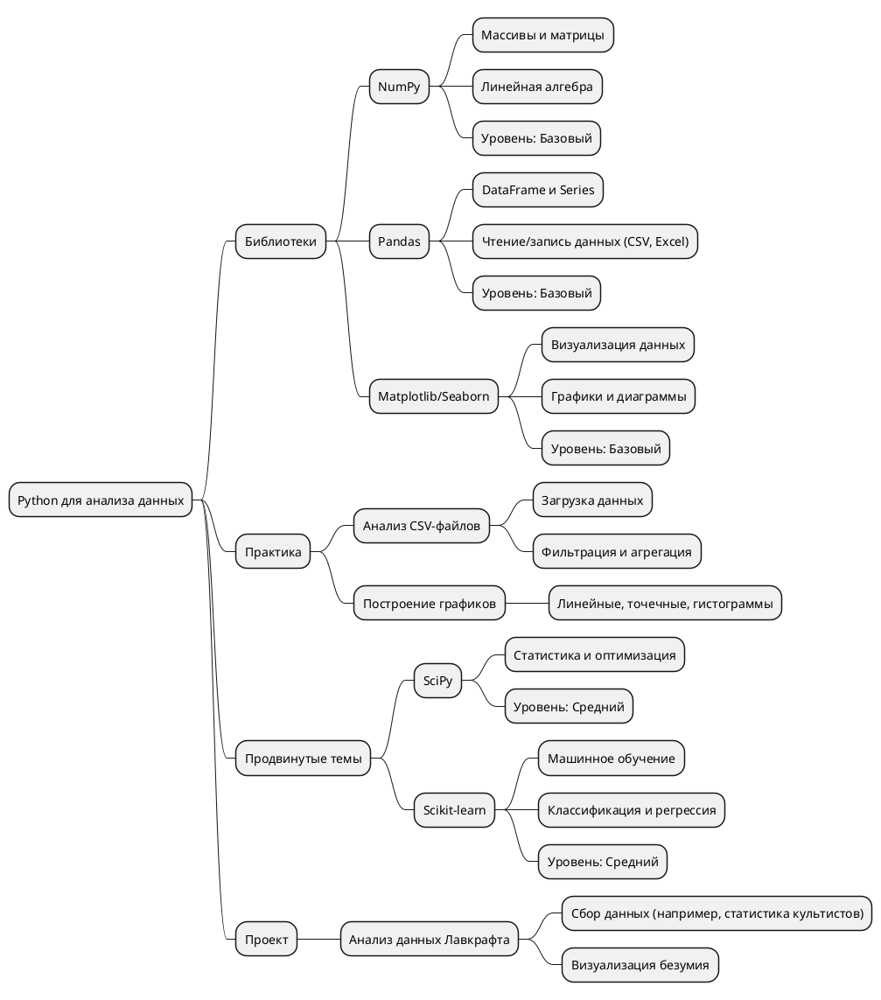

# Направления в Python в формате PlantUML
---

## Анализ данных и Data Science

**План действий:**

1. Установи numpy, pandas, matplotlib (pip install).
2. Начни с [[NumPy]]: массивы и простые вычисления.
3. Перейди к [[Pandas]]: работа с таблицами.
4. Освой визуализацию с [[Matplotlib]]/Seaborn.
5. Практика: проанализируй данные (например, csv с "жертвами Ктулху").
6. Двигайся к Scikit-learn для машинного обучения.

---
## Веб-разработка

